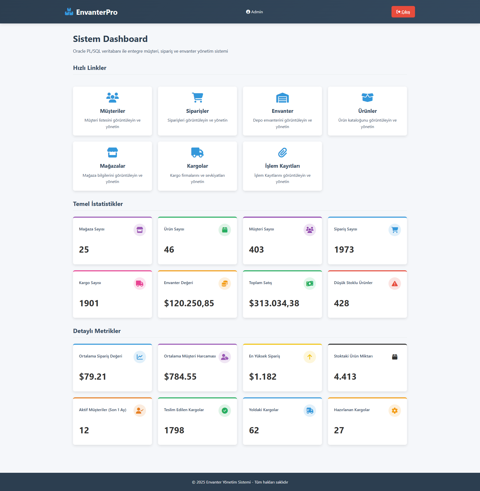
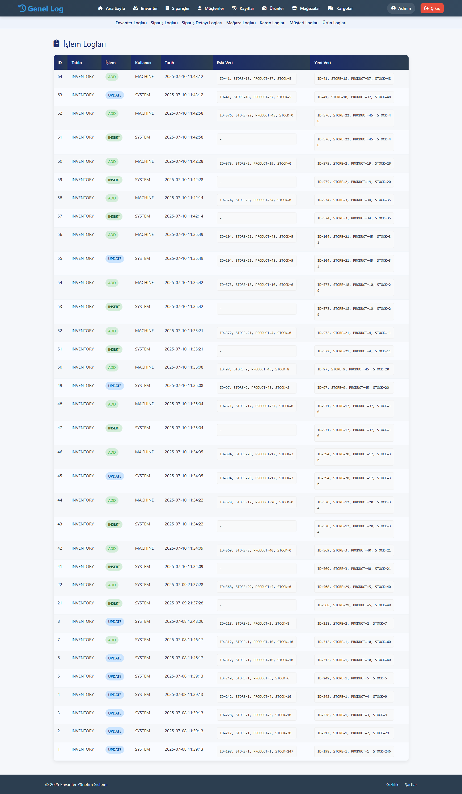
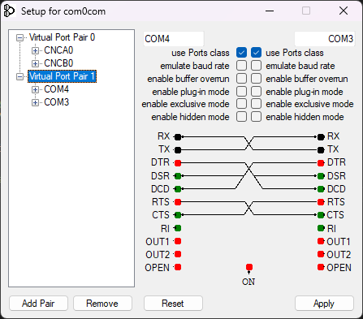

# Oracle Inventory, Order & Shipment Management System

This project is a complete **Inventory, Order, and Shipment Management System** built on **Oracle SQL and PL/SQL** with a **Flask** frontend. It manages product stocks, orders, shipments, customers, and stores using relational database structures with triggers, sequences, views, stored procedures, and audit logging.

Created by **aliozertekin**.

---

## Features

- Inventory management per store and product  
- Full order and order item tracking  
- Shipment handling and status tracking  
- **Serial port integration for real-time inventory updates**  
- Audit log tables for change tracking  
- JSON-supported product details  
- Blob/image storage for product and store visuals  
- Identity columns and sequences for auto-incrementing keys  
- Data integrity via foreign key and check constraints  
- Summary views for customer orders and purchased products  
- Automatic restock trigger on order cancel/refund  
- Modern UI with Flask, HTML, CSS, JavaScript  
- Oracle backend with PL/SQL stored procedures and packages  

---

## Technologies Used

- Python 3.13+  
- Flask  
- cx_Oracle  
- Oracle Database 21c+  
- HTML, CSS, JavaScript  
- PySerial  

---

## Serial Integration for Real-time Inventory Updates

The system now includes serial port integration for automatic inventory updates from external devices/machines. This feature allows real-time stock level adjustments based on physical inventory changes detected by connected sensors or machines.

### How It Works
1. **Machine Simulation**: `simulate_machine.py` generates random inventory update events
2. **Serial Receiver**: `receiver.py` listens to the serial port and processes incoming data
3. **Database Update**: Calls `ADD_INVENTORY` PL/SQL procedure to update stock levels

### Setup Guide
1. Connect your device/machine to a serial port (COM3/COM4)
2. Configure baud rate and port settings:
   ```python
   ser = serial.Serial('COM3', 9600, timeout=1)
   ```
3. Start the receiver script:
   ```bash
   python receiver.py
   ```
4. (Optional) Run machine simulator for testing:
   ```bash
   python simulate_machine.py
   ```

### Screenshots

**Main Interface**  
  

**Serial Log Window**  
  

**Serial Settings Configuration**  
  

### Sample Code
**receiver.py** (Serial Data Processor):
```python
import serial
import cx_Oracle
import time

# Seri port bağlantısı
ser = serial.Serial('COM3', 9600, timeout=1)

# Oracle bağlantı bilgileri
dsn = cx_Oracle.makedsn("localhost", 1521, service_name="FREE")
conn = cx_Oracle.connect(user="system", password="admin", dsn=dsn)

def process_serial_line(line):
    try:
        cursor = conn.cursor()
        store_id_str, product_id_str, quantity_str = line.strip().split(",")
        store_id = int(store_id_str)
        product_id = int(product_id_str)
        quantity = int(quantity_str)

        old_amount = cursor.var(cx_Oracle.NUMBER)
        new_amount = cursor.var(cx_Oracle.NUMBER)

        cursor.callproc("ADD_INVENTORY", [
            store_id,
            product_id,
            quantity,
            old_amount,
            new_amount,
            "MACHINE"
        ])

        print(f"[✓] Store={store_id} Product={product_id} +{quantity} → New: {new_amount.getvalue()}")

        conn.commit()
        cursor.close()
    except Exception as e:
        print(f"[Hata] {e}")

print("Dinleniyor...")

while True:
    try:
        cursor = conn.cursor()
        if ser.in_waiting > 0:
            line = ser.readline().decode('utf-8').strip()
            if line:
                print(f"Tarih: {time.strftime("%c")} Alındı: {line}")
                process_serial_line(line)
    except KeyboardInterrupt:
        print("Durduruluyor...")
        break
    except Exception as e:
        print(f"Okuma Hatası: {e}")
        time.sleep(1)
ser.close()
cursor.close()
```

---

## Schema Overview

### Core Tables

| Table Name    | Description                          |
|---------------|------------------------------------|
| PRODUCTS      | Stores product data with images and JSON details |
| STORES        | Physical or virtual store information |
| CUSTOMERS     | Customer identity and contact information |
| ORDERS       | Customer orders                     |
| ORDER_ITEMS   | Line items within orders            |
| SHIPMENTS     | Delivery records linked to orders  |
| INVENTORY    | Stock levels per product and store |

### Logging Tables

| Table Name       | Description                 |
|------------------|-----------------------------|
| ORDER_LOG        | Logs order-level changes    |
| ORDER_ITEMS_LOG  | Logs order item changes     |
| PRODUCT_LOG      | Logs product changes        |
| INVENTORY_LOG    | Logs inventory changes      |
| SHIPMENTS_LOG    | Logs shipment updates       |
| STORE_LOG        | Logs store-level changes    |
| CUSTOMER_LOG     | Logs customer changes       |
| AUDIT_LOG        | General audit trail         |

---

## Views

- `CUSTOMER_ORDER_PRODUCTS`  
  Summarizes each order with customer and purchased product details.

- `INVENTORY_VIEW`  
  Displays stock levels by store and product.

- `ORDERS_VIEW`  
  Overview of orders and their statuses.

- `PRODUCT_ORDERS`  
  Counts orders per product for popularity analysis.

- `PRODUCT_REVIEWS`  
  Aggregates product reviews (if applicable).

- `STORE_ORDERS`  
  Lists orders grouped by store.

- `VW_INVENTORY_STATS`  
  Inventory statistical summaries such as averages and minimum stock.

- `VW_ORDER_STATS`  
  Summarized order statistics including totals and cancellation rates.

- `VW_USER_COUNT`  
  Summarized counts of users/customers.

---

## Triggers

- `TRG_RESTOCK_ON_CANCEL_AND_REFUND`  
  Automatically restocks inventory when an order is canceled or refunded.

- `TRG_AUDIT_CUSTOMERS`  
  Audits all insert, update, delete operations on the `CUSTOMERS` table.

- `TRG_AUDIT_INVENTORY`  
  Tracks changes on the `INVENTORY` table.

- `TRG_AUDIT_ORDER_ITEMS`  
  Logs changes to order items.

- `TRG_AUDIT_ORDERS`  
  Audits changes on the `ORDERS` table.

- `TRG_AUDIT_PRODUCTS`  
  Audits changes on the `PRODUCTS` table.

- `TRG_AUDIT_SHIPMENTS`  
  Logs shipment status and data changes.

- `TRG_AUDIT_STORES`  
  Audits changes on the `STORES` table.

- `TRG_LOG_CUSTOMERS`, `TRG_LOG_INVENTORY`, `TRG_LOG_ORDER_ITEMS`, `TRG_LOG_ORDERS`, `TRG_LOG_PRODUCTS`, `TRG_LOG_SHIPMENTS`, `TRG_LOG_STORES`  
  Additional logging triggers that record detailed changes to their respective log tables.

---

## Stored Procedures

- `ADD_CUSTOMER`  
  Adds a new customer record.

- `ADD_INVENTORY`  
  Inserts or updates inventory stock.

- `ADD_ORDER`  
  Creates new orders and manages related tables.

- `ADD_PRODUCT`  
  Adds a new product.

- `ADD_SHIPMENT`  
  Adds shipment details for an order.

- `ADD_STORE`  
  Inserts a new store record.

- `DELETE_CUSTOMER`  
  Deletes a customer record (soft/hard as per business rules).

- `DELETE_INVENTORY`  
  Deletes or updates inventory records.

- `DELETE_ORDER`  
  Deletes an order and its items.

- `DELETE_PRODUCT`  
  Deletes a product.

- `DELETE_PRODUCT_IMAGE`  
  Deletes images associated with products.

- `DELETE_SHIPMENT`  
  Deletes shipment records.

- `DELETE_STORE`  
  Deletes a store record.

- `PRINT_ORDER_TOTAL`  
  Calculates and outputs the total amount for an order.

- `RESTOCK_ORDER_PRODUCTS`  
  Restores inventory for canceled or refunded orders (used by restock trigger).

---

## Sequence Generators

| Sequence Name   | Starting Value |
|-----------------|----------------|
| INVENTORY_SEQ   | 568            |
| SHIPMENT_SEQ    | 2029           |
| SHIPMENTS_SEQ   | 2029           |
| STORE_SEQ       | 31             |

---

## Installation & Setup

1. Ensure Oracle Database 21c+ is running and accessible.  
2. Clone this repository:
   ```bash
   git clone https://github.com/aliozertekin/flask_inventory_system.git
   cd flask_inventory_system
   ```
3. Install Python dependencies:
   ```bash
   pip install -r requirements.txt
   ```
   If you don't have a requirements file:
   ```bash
   pip install flask cx_Oracle pyserial
   ```
4. Configure Oracle connection in `db/connection.py`:
   ```python
   import cx_Oracle
   dsn = cx_Oracle.makedsn("localhost", 1521, service_name="FREE")
   conn = cx_Oracle.connect("your_user", "your_password", dsn=dsn)
   ```
5. Run the SQL scripts in `db/sql/` folder to create the schema:
   ```sql
   @co_create.sql
   @co_install.sql
   @co_populate.sql
   ```
6. Start the Flask application:
   ```bash
   python app.py
   ```
7. Open [http://localhost:5000](http://localhost:5000) in your browser.

---

## Project Structure

```
flask_inventory_system/
│
├── app.py                      # Main application entry point
├── receiver.py                 # Serial port data receiver
├── simulate_machine.py         # Machine data simulator
├── db/
│   ├── connection.py           # Oracle DB connection setup
│   └── sql/                    # SQL scripts for schema and logic
│
├── images/                     # Application screenshots
│   ├── index_window.png
│   ├── log_window.png
│   └── serial_settings.png
│
├── modules/                    # Modules for easier handling
├── routes/                     # Flask route handlers
├── templates/                  # HTML templates
├── static/                     # CSS and JavaScript assets
├── LICENSE
└── README.md
```

---

## License

This project is licensed under the MIT License.

---

Built with Flask and Oracle PL/SQL  
Created and maintained by aliozertekin.
